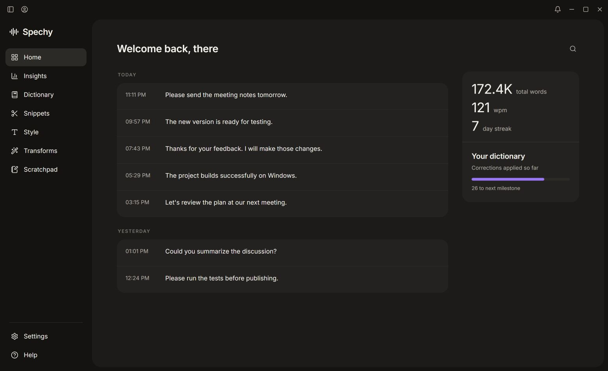
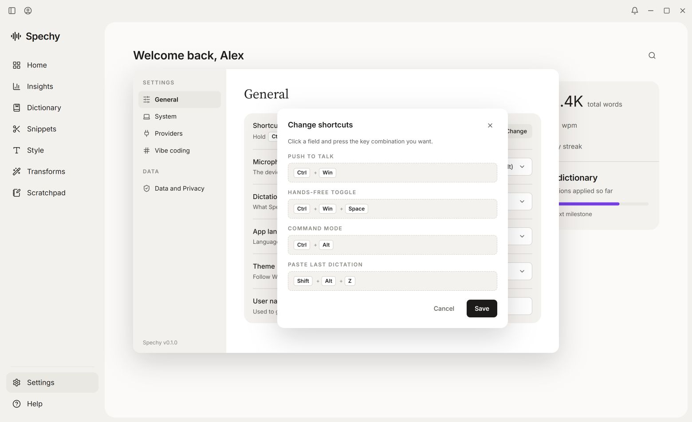

<p align="center">
  
</p>
<h1 align="center">Spechy</h1>
<p align="center"><strong>Speak naturally. Keep your flow.</strong><br>Open-source voice dictation for Windows, with your choice of AI.</p>

<p align="center">
  <a href="https://github.com/R-ACU/spechy-releases/releases/latest"></a>
  <a href="https://github.com/R-ACU/spechy/actions/workflows/build.yml"></a>
  <a href="LICENSE"></a>
  
</p>

<p align="center">
  <a href="https://github.com/R-ACU/spechy-releases/releases/latest/download/Spechy-Setup.exe"><strong>Download for Windows</strong></a>
  &nbsp;&nbsp;/&nbsp;&nbsp;
  <a href="#get-started">Get started</a>
  &nbsp;&nbsp;/&nbsp;&nbsp;
  <a href="#build-it-yourself">Build from source</a>
  &nbsp;&nbsp;/&nbsp;&nbsp;
  <a href="https://github.com/R-ACU/spechy/issues">Report an issue</a>
</p>



<p align="center"><sub>Real Spechy interface. Screenshots use demonstration data.</sub></p>

## From a thought to finished text

Hold **Ctrl + Win**, say what you mean, and release. Spechy transcribes your voice, cleans up the text and inserts it into the app you were using.

Use it for emails, documents, chat messages, code explanations and prompts. Keep your own vocabulary, choose a writing style for each app, and switch providers whenever you want.

**No Spechy account. No Spechy subscription. Your provider, your models.** Cloud providers may charge for API usage; local processing requires your own compatible server.

## What you can do

| | |
| :--- | :--- |
| **Dictate anywhere** | Push-to-talk, hands-free recording and voice commands for selected text. A small native pill keeps recording status visible. |
| **Make it sound like you** | Dictionary corrections, reusable snippets, app-specific styles and custom text transforms. |
| **Choose your AI** | Groq, OpenRouter or custom OpenAI-compatible endpoints. Pick models from a searchable list. |
| **Keep useful work** | Searchable dictation history, usage insights, a scratchpad and a shortcut to paste your last dictation again. |
| **Work comfortably** | Light, dark and system themes; configurable shortcuts, microphone selection and optional launch at login. |

## Get started

1. **Install.** Download [Spechy-Setup.exe](https://github.com/R-ACU/spechy-releases/releases/latest/download/Spechy-Setup.exe) and run it on Windows 10 or 11, x64.
2. **Connect a provider.** Add your own Groq or OpenRouter key in onboarding, or configure a custom server. Choose a microphone and test your setup.
3. **Speak.** Focus a text field, hold **Ctrl + Win**, speak, then release.

The installer is currently unsigned. Windows may display an unknown-publisher warning. Download only from the releases linked in this repository; each release includes a SHA-256 checksum.

### Your shortcuts

| Action | Default shortcut |
| :--- | :--- |
| Push to talk | <kbd>Ctrl</kbd> + <kbd>Win</kbd> |
| Start / stop hands-free | <kbd>Ctrl</kbd> + <kbd>Win</kbd> + <kbd>Space</kbd> |
| Voice command for selected text | <kbd>Ctrl</kbd> + <kbd>Win</kbd> + <kbd>Shift</kbd> |
| Paste last dictation | <kbd>Shift</kbd> + <kbd>Alt</kbd> + <kbd>Z</kbd> |
| Cancel recording | <kbd>Esc</kbd> |

Change them in **Settings > General > Shortcuts**. Paste last dictation uses the latest saved history entry, including after restarting Spechy. It is inactive during an ongoing dictation.

<details>
<summary><strong>See the shortcut settings</strong></summary>



</details>

## Your models. Your setup.

| Step | Hosted providers | Custom endpoint |
| :--- | :--- | :--- |
| Transcription | Groq Whisper or audio-capable OpenRouter models | OpenAI-compatible `/audio/transcriptions` |
| Text cleanup | Groq or OpenRouter chat models | OpenAI-compatible `/chat/completions` |

Use **Settings > Providers** to pick your models. A custom server can run on your own machine or infrastructure. For fully local processing, configure local servers for **both** transcription and cleanup. Leave the key empty if your server does not require authentication.

### What stays local

Settings, history, dictionary and snippets live in `%APPDATA%\com.remo.spechy`. API keys are stored in local settings and excluded from data exports. No keys are bundled with the app.

Cloud transcription sends audio to the selected provider; cloud cleanup sends text. Release builds do not save raw microphone recordings. Update checks contact GitHub. Spechy does not provide or operate an inference backend.

## Updates

Open **Help > Updates**. Spechy checks for a newer release and offers its installer. Download and run it to update; your existing settings and history are retained.

**Updates are not downloaded or installed silently.** The [permanent download link](https://github.com/R-ACU/spechy-releases/releases/latest/download/Spechy-Setup.exe) always points to the latest published installer, so it can also be used on a website.

## Build it yourself

You need Windows, Node.js, Rust and the Microsoft C++ build tools with a Windows SDK. WebView2 is required to display the app.

```powershell
git clone https://github.com/R-ACU/spechy.git
cd spechy
npm ci
npm run tauri dev
```

Run the checks and create a Windows installer:

```powershell
npx tsc --noEmit -p .
cargo test --locked --manifest-path src-tauri/Cargo.toml --lib
npm run tauri build
```

The installer is written to `src-tauri/target/release/bundle/nsis/`.

### Inside Spechy

```text
src/                     React + TypeScript interface
  components/            Shared controls and update UI
  views/                 Dictation history, tools and settings
  lib/                   Typed Tauri commands and application state
src-tauri/src/           Rust desktop application
  hotkey.rs              Global shortcut handling
  audio.rs               Microphone capture
  pipeline.rs            Dictation state machine
  stt.rs / polish.rs     Transcription and text cleanup
  paste.rs / pill.rs     Text insertion and native recording UI
  db.rs / settings.rs    Local persistence
  updates.rs             Public release checks
scripts/release.ps1      Maintainer release workflow
```

Tauri 2, React 19, TypeScript and Rust. The recording pill is native Win32; closing the main window destroys its WebView while the app remains available in the tray.

## Contributing

Bug reports, reproducible fixes and focused pull requests are welcome. Read [CONTRIBUTING.md](CONTRIBUTING.md) for the development workflow and what to include in an issue.

This is an early Windows release. Administrator-elevated target apps, hardware-specific audio behavior and individual local model servers need real-world testing. macOS and Linux are not supported.

<details>
<summary><strong>Maintainer: publish a release</strong></summary>

Set the same version in `package.json`, `src-tauri/Cargo.toml` and `src-tauri/tauri.conf.json`, refresh both lockfiles, and commit the changes. Write English release notes to a file, then run:

```powershell
powershell -NoProfile -ExecutionPolicy Bypass -File scripts/release.ps1 -NotesFile <path>
```

The script checks the working tree and versions, runs tests, builds the installer, pushes source and a version tag, and publishes the installer with its checksum. The maintainer needs GitHub CLI access to both repositories. No GitHub token is embedded in Spechy.

</details>

## License and credits

Spechy source code is available under the [MIT License](LICENSE). Dependencies and third-party assets retain their own licenses; see [THIRD_PARTY_NOTICES.md](THIRD_PARTY_NOTICES.md). Spechy is an independent project and is not affiliated with Wispr Flow, Groq or OpenRouter.
